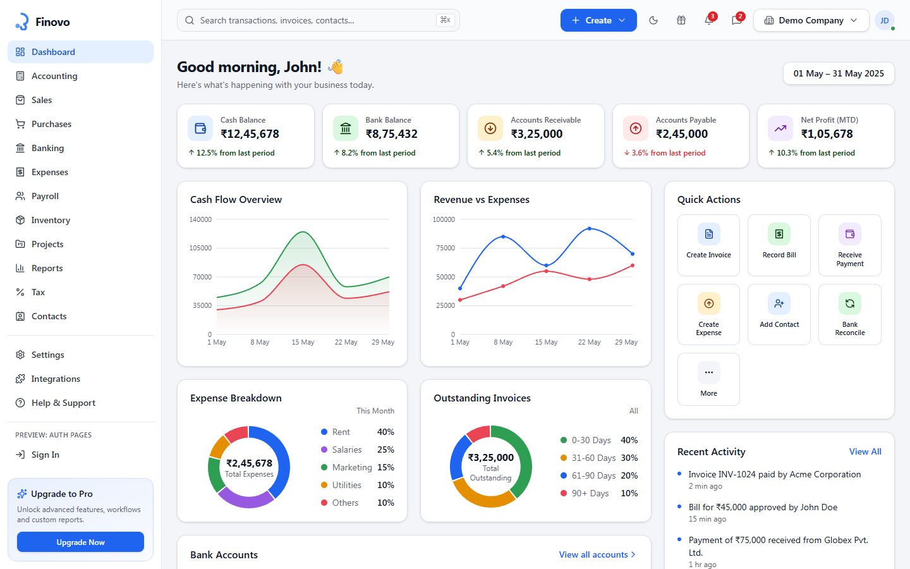

# Finovo

A free, open-source React accounting/ERP admin dashboard — invoicing, purchases, banking, expenses, payroll, inventory, projects, GST/TDS tax filing, reports and contacts, plus a fully-tabbed settings area.



**[Live Preview](https://finovo.codespanda.com/)** · **[Documentation](https://finovo.codespanda.com/docs)** · **[Template Showcase](https://claude.ai/code/artifact/baa5935f-2b97-4812-9286-a4d1870ea289)**

## What's included

- **Dashboard** — cash & bank balances, receivables/payables, cash flow and expense trend charts
- **Accounting** — journal entries, chart of accounts, cash flow, income & expense summaries
- **Sales** — invoices, estimates, credit notes, customers, payments receivable, products & services
- **Purchases** — bills, purchase orders, vendors, debit notes, payables, recurring bills
- **Banking** — bank accounts, bank feed, reconciliation, auto-match rules, statements
- **Expenses** — expense claims, categories, approval workflows, mileage, tax deductions
- **Payroll** — employees, payroll runs, pay slips, statutory taxes & deductions
- **Inventory** — items, categories, warehouses, stock adjustments, transfers, stock count, batch/serial tracking
- **Projects** — tasks, timesheets, milestones, team, calendar, files, project billing
- **Tax** — full GST suite (GSTR-1/3B, e-way bills, ITC, reconciliation) and TDS suite (challans, deductors/deductees, Forms 130/131/133, correction returns, PAN verification)
- **Reports** — P&L, balance sheet, cash flow, AR/AP aging, and per-module report centers
- **Contacts** — unified customer/supplier/employee directory with groups
- **Settings** — company profile, users & roles, notifications, security, audit log and more
- **Auth screens** — sign in and sign up pages outside the dashboard shell

## Tech stack

React · Vite · TypeScript · Tailwind CSS · shadcn/ui · radix-ui · React Router · Recharts

## Getting started

```bash
git clone https://github.com/codespanda/finovo.git
cd finovo
npm install
npm run dev
```

Open [http://localhost:5173](http://localhost:5173). See the full [documentation](https://finovo.codespanda.com/docs) for project structure, available routes, and theming.

## Notes

This is a UI-only demo — every page is driven by static TypeScript fixtures across `src/pages`, with no backend or persistence layer. Wiring up your own API is on you.

## License

MIT
